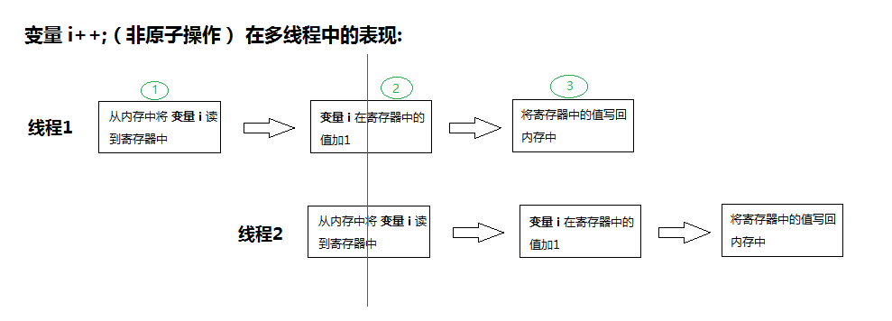
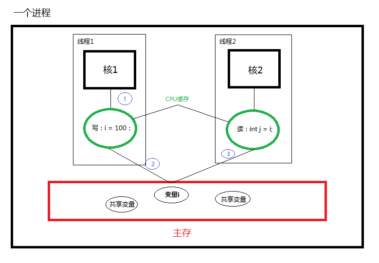

#### 系列文章
[用Go语言学习并发 - 0.概述](https://github.com/k2huang/blogpost/blob/master/golang/%E5%B9%B6%E5%8F%91%E7%BC%96%E7%A8%8B/%E5%AE%9E%E7%94%A8%E6%95%99%E7%A8%8B/%E7%94%A8Go%E8%AF%AD%E8%A8%80%E5%AD%A6%E4%B9%A0%E5%B9%B6%E5%8F%91%20-%200.%E6%A6%82%E8%BF%B0.md)<br/><br/>

现代编程语言大多支持线程，而多线程编程是并发编程中最常用的方法，Go语言通过Goroutine来支持并发编程，有关其原理可以看这篇[Go并发机制](https://github.com/k2huang/blogpost/blob/master/golang/%E5%B9%B6%E5%8F%91%E7%BC%96%E7%A8%8B/%E5%B9%B6%E5%8F%91%E6%9C%BA%E5%88%B6/Go%E5%B9%B6%E5%8F%91%E6%9C%BA%E5%88%B6.md)。<br/><br/>
本文主要从宏观上说说在并发编程中
1. 为什么需要锁？
2. 锁的作用是什么？
3. 死锁问题和常见解决方法

#### 第一把锁
先看一个简单的程序：
```go
func main() {
	var (
		counter int
		wg      sync.WaitGroup   // 用于统计正在运行Goroutine的数量
	)

	start := time.Now()
	for i := 0; i < 100; i++ {
		wg.Add(1)
		go func() {
			defer wg.Done()
			for i := 0; i < 10000; i++ {
				counter++
			}
		}()
	}
	wg.Wait()   // 等待所以Goroutine都执行完
	elapsed := time.Since(start)
	fmt.Println("counter:", counter)
	fmt.Println("time consume:", elapsed.Seconds(), "s")
}
```
某一次的运行结果(我的电脑是4核8线程的CPU)：
```go
counter: 233608		// 结果并不确定
time consume: 0.0010018 s
```
上面的程序是用100个Goroutine同时对counter进行加1计数并且每个Goroutine加了10000，因此理论上counter的最终值应该是100 0000的，但现在这个结果并不对，到底发生了什么？<br/>
其实 **counter++** 这个操作看起来很简单，但其不是一个原子操作（可简单理解为不可分割，在执行的过程中不可中断的操作，以后还会具体介绍）。下面用两个线程同时加1的情况来说明问题：

如上图所示，如果线程1在对变量i的自增进行到step2，线程2也开始对变量i执行自增(step1)，等两个线程都完成自增操作（step3）之后，变量i的值相当于只加1了一次，推广到多个线程同时进行自增的情况，结果就更无法预料，正如上面的程序结果所示。<br/>如果我们能够保证线程2的自增操作总是在线程1完成之后才开始，那应该就不会出错了，用锁来保护自增操作就可以做到如此：
```go
		...
		go func() {
			defer wg.Done()
			for i := 0; i < 10000; i++ {
				mtx.Lock()	// 上锁，mtx为 sync.Mutex 的实例
				counter++   	// 临界区
				mtx.Unlock() 	// 解锁
			}
		}()
		...
```
为Goroutine中的自增操作加上锁保护之后(完整代码在[这里](https://github.com/k2huang/goapps/blob/master/firstlock/firstlock.go))：
```go
counter: 1000000
time consume: 0.0691851 s
```
不管运行多少次，结果总是正确的，但总的运行时间要多了许多。因此，锁在带来程序正确性的同时也带来了性能上的代价，但正确性是必要的。<br/>
从上面的示例我们可以得出锁的第一个作用：**互斥访问共享资源**，也就是保证锁所保护的区域在同一时刻只能有一个线程访问，这样可以保证对于像 counter++ 这样的非原子操作完全执行完之后，另一个线程才能继续对 共享变量counter 执行操作。<br/>
其实锁还有另外一个作用：**保证内存可见性**，这个作用比较隐晦一点。在如下代码中即使Goroutine1在执行顺序上先与Goroutine2，如果两个Goroutine被调度到不同的cpu core上执行，那 j 的值有可能还是 0，而不是100。也就是说Goroutine2执行时间就算晚于Goroutine1，也不能保证Goroutine2拿到的i的值是Goroutine1更新之后的值100.
```go
// Global
var i = 0

// Goroutine1
i = 100

// Goroutine2
j := i
```
这是为什么呢？先上一张示意图：

按正常的逻辑来理解，线程1在执行完 i = 100之后(step1)，内存中变量i的值更新为100（step2），然后线程2在读取变量i的值时（step3），i==100。 但现实并不会如此美好，因为线程1在执行完step1之后，可能并不会**马上**执行step2导致之后的线程2读取的i仍然是旧值。 为什么执行完 i = 100 的赋值，内存中i的值可能并不会马上被更新呢？我们的代码在从 **源码 --(编译器)--> 可执行文件 --> CPU并序执行** 的过程中，编译器和CPU并序执行并不会按照人类的意愿（既快又正确的）去运行，它们只会在遵从语言规范（或内存模型）和CPU指令集的限制的情况下，让我们的程序以越快越好的方式运行完。在这种情况下，像 i = 100 这种赋值操作，可能会被优化，将i的最新值100暂时存在CPU的寄存器中，而先不同步到内存中，因为同步到内存中更耗时嘛，等待线程1执行完或被切换出CPU执行，才被更新到内存。这时锁的第二个作用（保证内存可见性）要发挥作用了。伪代码如下
```go
// 线程1
lock
i = 100
unlock

// 线程2
lock
j = i
unlock
```
在对变量i进行读写之前，先用锁保护起来，这样可以保证 **如果对变量的写操作发生在读操作之前, 读线程可以 看见 写线程对变量内存的更新。**。<br/>

#### 多把锁与死锁问题
上面讲了锁的两个作用，现在来说说使用锁的另一个令人头疼的问题：既然锁这么有用，那我们只要涉及并发共享资源的问题就用锁来解决不就好了，说是可以这么说，但使用的方式还是有讲究的，不然将带来 死锁 问题。<br/>
考虑如下生活场景：现在有两个玩具A和B, 小红与小明都想要**同时**玩两个玩具，于是两人开始争抢了起来..., 用代码模拟（完整代码在[这里](https://github.com/k2huang/goapps/blob/master/deadlock/deadlock.go)）如下:<br/>
```go
var (
	lockA sync.Mutex
	toyA  = "toyA"
)

var (
	lockB sync.Mutex
	toyB  = "toyB"
)

	go func() { //小红
		fmt.Println("小红抢:", toyA)
		lockA.Lock()
		{
			fmt.Println("小红拿到:", toyA)
			time.Sleep(100 * time.Millisecond) //模拟业务
			{
				fmt.Println("小红抢", toyB)
				lockB.Lock()
				{
					fmt.Println("小红拿到:", toyB)
					time.Sleep(100 * time.Millisecond) //模拟业务
				}
				lockB.Unlock()
			}
		}
		lockA.Unlock()
	}()

	go func() { //小明
		fmt.Println("小明抢:", toyB)
		lockB.Lock()
		{
			fmt.Println("小明拿到:", toyB)
			time.Sleep(100 * time.Millisecond) //模拟业务
			{
				fmt.Println("小明抢", toyA)
				lockA.Lock()
				{
					fmt.Println("小明拿到:", toyA)
					time.Sleep(100 * time.Millisecond) //模拟业务
				}
				lockA.Unlock()
			}
		}
		lockB.Unlock()
	}()
```
如果小红在抢到了玩具A的同时，小明抢到了玩具B，那两个人就会僵持住，谁都无法在不放弃自己的玩具的情况下得到另一方的玩具(由于两人都想同时拥有两个玩具)。以上代码运行结果如下:
```go
小明抢: toyB
小明拿到: toyB
小红抢: toyA
小红拿到: toyA
小红抢 toyB
小明抢 toyA
fatal error: all goroutines are asleep - deadlock!
```
这种情况就是所谓的“死锁”问题。<br/>从上面这个例子可以看出：当有多个不同的共享资源时，我们通常需要使用和共享资源同等数量的锁来一对一的保护共享资源。如果多个线程在访问共享资源的时候没有按照合理的方法，就有可能会造成死锁的问题。<br/><br/>
那有什么方法可以避免死锁呢？<br/>
1. 资源排序<br/>
就是多个线程对共享资源的访问按照事先规定的顺序，而不是不同线程可以用不同的顺序访问。如上述小红与小明的问题，如果事先约定都是按照 从玩具A到玩具B的顺序 争抢，问题自然解决。关键代码如下:
```go
	go func() { //小明 - 与小红一样: 按照 A->B 的顺序抢玩具
		fmt.Println("小明抢:", toyA)
		lockA.Lock()
		{
			fmt.Println("小明拿到:", toyA)
			time.Sleep(100 * time.Millisecond) //模拟业务
			{
				fmt.Println("小明抢", toyB)
				lockB.Lock()
				{
					fmt.Println("小明拿到:", toyB)
					time.Sleep(100 * time.Millisecond) //模拟业务
				}
				lockB.Unlock()
			}
		}
		lockA.Unlock()
	}()
```
运行结果：
```
小明抢: toyA
小明拿到: toyA
小红抢: toyA
小明抢 toyB
小明拿到: toyB
小红拿到: toyA
小红抢 toyB
小红拿到: toyB
```
该方法简单易理解，虽然对性能有不小的性能，但为了保证程序的正确性也是没有办法的事。如果遇到多把锁问题，应优先考虑该方法。

2. 试锁定-回退<br/>
这种方法需要标准库的锁的API支持trylock方法，调用trylock会立即返回，如果获取锁成功就返回true, 否则返回false。如java中的Lock.trylock(), linux pthread_mutex_trylock, C++11 std::timed_mutex::try_lock等等。很可惜Go语言现在的标准库并不支持该方法，但不代表不能自己去实现，如果你感兴趣可以[参考这篇文章](http://colobu.com/2017/03/09/implement-TryLock-in-Go/)。<br/>
**试锁定-回退** 方法的核心思想是，如果在执行一个代码块的时候，需要先后（顺序不定）锁定两把锁，那么在成功锁定其中一把锁之后应该使用**试锁定的方法来锁定另一把锁**。如果试锁定第二把锁失败，就把已锁定的第一把锁解开，并重新对这两把锁进行锁定和试锁定。<br/> 
该方法也不算难理解，但实践起来比较复杂，尤其当锁的数量多于两把时，而且这种方法可以会出现另一个问题 - **活锁**。还拿以上小红与小明的例子来说，如果小红每次都是先抢到玩具A，同时小明抢到了玩具B，然后两人在争抢对方的玩具失败之后，都回退重试..., 就这样在失败，回退和重试之前重复N次，当然每次都这么巧也是不太可能的，因此活锁是有机会自己恢复正常的，但死锁是不可能的。<br/>

#### 锁的公平性
当多个线程同时抢占同一把互斥锁时，只有一个线程可以成功，剩下的线程都要进入锁的同步队列中排队，**公平性锁**会保证同步队列中的线程按照FIFO的方式去获取到锁，且**新加入争抢的线程**发现锁的同步队列中有等待线程，就只能将自己放入队尾按先来后到来排队。而**非公平性锁**，新加入争抢的线程 将与同步队列队首等待获取锁的线程站在同一起跑线上争夺锁。因此非公平锁容易造成锁的同步队列中的争抢线程“饥饿”（如新加入争抢的线程每次都比同步队列队首线程先抢到锁）的情况，那为什么还需要这种锁呢？<br/>
答案是**非公平锁**可以减少线程做上下文切换的机会，从而提高性能。But how? 如果我们把每次不同线程获取到锁定义为一次切换，公平性锁保证了锁的获取按照FIFO原则，而代价是进行大量的线程切换。**非公平性锁**允许新加入争抢的线程与同步队列队首等待获取锁的线程站在同一起跑线上争夺锁，如果新加入争抢的线程是刚刚释放锁的线程，其获取锁的机会将很大，如果其再次获取锁成功，就不需要进行上下切换了。因此非公平性锁虽然可能造成线程“饥饿”，但减少了线程切换，保证了其更大的吞吐量。<br/>
而Go语言的sync.Mutex实现上更偏向非公平性：如果某一个Goroutine在获取锁失败之后，通常会先自旋一小段时间，如果还是无法获取成功才进入锁的同步队列排队等待(具体实现源码可以参考[这篇文章](http://legendtkl.com/2016/10/23/golang-mutex/))。这样某一个goroutine在释放锁之后马上又去获取锁成功的机会很大。以下是一段[试验代码](https://github.com/k2huang/goapps/blob/master/unfairlock/unfairlock.go)以及某一次运行结果:
```go
	var m sync.Mutex
	log.SetFlags(log.Lmicroseconds)
	
	go func() {
		log.Println("1, start to lock...")
		m.Lock()
		log.Println("1, locked")
		m.Unlock()
		log.Println("1, unlocked")
	}()
	
	go func() {
		log.Println("2, start to lock...")
		m.Lock()
		log.Println("2, locked")
		m.Unlock()
		log.Println("2, unlocked")
	}()
	
	log.Println("main, start to lock...")
	m.Lock()
	log.Println("main, locked")
	time.Sleep(3 * time.Millisecond)
	m.Unlock()
	log.Println("main, unlocked")
	
	log.Println("main, start to lock again...")
	m.Lock()
	log.Println("main, locked again")
	m.Unlock()
	log.Println("main, unlocked again")
	
	time.Sleep(time.Second)
	log.Println("main, end")
```
```
23:35:43.547841 main, start to lock...
23:35:43.560877 main, locked
23:35:43.547841 1, start to lock...
23:35:43.547841 2, start to lock...
23:35:43.563913 main, unlocked
23:35:43.563913 main, start to lock again...
23:35:43.563913 main, locked again
23:35:43.563913 main, unlocked again
23:35:43.563913 1, locked
23:35:43.563913 1, unlocked
23:35:43.563913 2, locked
23:35:43.563913 2, unlocked
23:35:44.564335 main, end
```
从结果上看，main goroutine在先获取到锁之后，goroutine 1,2获取锁时被阻塞，然后main goroutine在释放锁之后马上又去抢占锁，又比goroutine 1,2先获取到了锁。

#### 使用锁的一些建议
1.多个线程会并发访问同一份共享资源，并且存在写操作时，一定要记住用锁来保护共享资源。通常不同的共享资源用不同的锁来保护，多把锁要注意死锁问题。<br/>
2.由于使用锁会降低并发的性能，所以应尽量减少锁的作用域(lock与unlock之间的区域)，即锁只是用来保护共享资源的，不要将不相关的部分放在锁的作用域中。<br/>
3.多个线程对共享资源的访问，在读多写少情况下考虑用读写锁(如Go标准库中的sync.RWMutex)来提高性能。<br/>
4.尽量不要在持有锁(已抢占到某一共享资源)的同时，去访问其他共享资源（也即拿着一把锁的时候又去试图抢另一把锁，容易造成死锁）。当然有时会不太好避免，这时可以考虑对资源排序，即多个线程都按照统一的顺序访问共享资源。<br/>
5.由于Go语言不支持**可重入锁**(也称递归锁)，要避免同一个goroutine在unlock之前多次lock同一把锁，不然该goroutine将无法继续运行与也无法退出(goroutine泄漏)。<br/>
6.获取锁的API除了lock, 还有trylock和timedlock(如linux pthread_mutex_timedlock，java Lock.trylock的重载版本，调用方可以指定为了获取锁而等待的时间，如果超时还未获取到锁就返回false，而不像lock方法死等到底)，在不同的场景可以考虑使用不同的API。很可惜Go语言标准库又不支持，可能是想让我们多考虑用channel(后续会单独写一篇介绍Go channel的文章)！

#### 经典问题：哲学家进餐问题

1. 问题描述

场景：5个哲学家，5把叉子，5盘意大利面（意大利面很滑，需要同时用两把叉子才能拿起）大家围绕桌子，进行思考与进餐的活动。

哲学家的活动方式为：要么放下左右手刀叉进行思考，要么拿起刀叉开始进餐（刀叉拿起时，必须拿两把，而且只能左右手依次拿，先左手拿左边，后右手拿右边，或者先右手拿右边，左边拿左边）。且只有这两种交替状态。

2. 问题分析

如果5个哲学家某一时刻恰好赶上同时想进餐，于是都同时拿起了右(或左)手边的叉子，那将导致5个人都无法拿到左（或右）手边的叉子并进餐，也就是发生了“死锁”问题。在这篇文章中，我先用上面讲到的资源排序的方法解决这个问题。后续文章还会介绍其他解法。

3. 代码实现

[有问题版本代码](https://github.com/k2huang/goapps/blob/master/philosopher_problem_version/philosopher.go) - 模拟问题，关键代码如下：
```go
	for i := 0; i < 5; i++ {
		//所有哲学家要拿起的第一把叉子正好是左手边的，
		//要拿起的第二把叉子正好是右手边的
		philosophers[i] = New(fmt.Sprintf("P%d", i), forks[i], forks[(i+1)%5])

		wg.Add(1)
		go func(i int) {
			defer wg.Done()

			philosophers[i].ThinkOrEat()
		}(i)
	}
```
结合代码与上图标记的序号可以看出，若所有哲学家同一时刻拿起第一把叉子(都是左手边的)，将出现死锁问题。<br/>
[资源排序版本代码](https://github.com/k2huang/goapps/blob/master/philosopher_resource_sort/philosopher.go) - 我们还是将5把叉子按上图所示排一个全局ID号，并要求哲学家拿起的第一把叉子的id号必须比第二把小，即抢占资源的顺序是按一个全局的资源排列来进行的。关键代码如下：
```go
func New(name string, first, second *Fork) *Philosopher {
	p := &Philosopher{name: name}

	//资源排序关键代码：
	//保证第一把要拿起的叉子必须是id较小的
	if first.ID < second.ID {
		p.first = first
		p.second = second
	} else {
		p.first = second
		p.second = first
	}

	return p
}
```
此时当P0-P3 4位哲学家在都拿起左手边的叉子(0-3)的同时, 哲学家P4只能等待而不是去先拿叉子4，然后哲学家P3就有机会拿到第二把叉子(4)开始进餐了。


#### 参考
Go并发编程实战 第2版<br/>
七周七并发模型<br/>
Java并发编程的艺术
