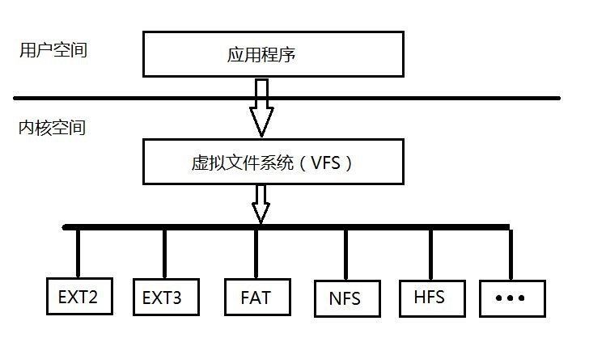
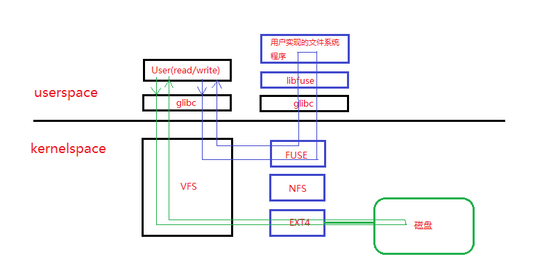

### 1. 前言
当我们在linux系统上访问磁盘上的一个文件时，要经历 open -> read/write -> close 流程，其中涉及的操作都是通过linux内核提供的**系统调用**来触发，并最终访问到磁盘上的文件。从linux文件系统的角度，我们的访问过程要经历 系统调用 --> 虚拟文件系统(VFS) --> 真实文件系统(如ext4，NFS...), 这也是linux文件系统主要的3大块。3大块中需要特别拿出来说说的就是VFS了，linux内核为了支持多种文件系统，如NFS，ext4..., 抽象出来了一层VFS，然后通过VFS来管理真实的文件系统，这样我们就可以用同样的方式访问不同的文件系统。如下图：
如果现在我们想实现一套自己的文件系统，按传统的做法，我们要与内核(VFS)打交道，然而对于应用程序开发的我们来说，那也忒可怕了，谁想去编译与调试内核呀！幸运的是现在我们可以用FUSE(filesytem in userspace)来实现, 编写FUSE文件系统时，只需要内核加载了fuse内核模块即可（自己单独安装），不需要重新编译内核。

### 2. FUSE概述
用户空间文件系统（Filesystem in Userspace，简称FUSE）是操作系统中的概念，指完全在用户态实现的文件系统。目前Linux通过内核模块对此进行支持。一些文件系统如ZFS，glusterfs和luster使用FUSE实现。Linux用于支持用户空间文件系统的内核模块名叫FUSE，FUSE一词有时特指Linux下的用户空间文件系统。Linux从2.6.14版本开始通过FUSE模块支持在用户空间实现文件系统。<br/>
在用户空间实现文件系统能够大幅提高生产率，简化了为操作系统提供新的文件系统的工作量，特别适用于各种虚拟文件系统和网络文件系统。上述ZFS和 glusterfs都属于网络文件系统。但是，在用户态实现文件系统必然会引入额外的内核态/用户态切换带来的开销，对性能会产生一定影响。<br/>
目前Linux，FreeBSD,NetBSD,OpenSolaris和Mac OSX支持用户空间态文件系统。

### 3. FUSE模块组成与工作原理

如上图所示，FUSE由三大模块组成：1. FUSE内核模块，主要实现VFS接口。2. libfuse用户库，主要提供负责与FUSE内核模块交互的功能。3.用户实现的文件系统，这个就是我们要自己开发实现的部分，当然是基于libfuse库来实现。<br/><br/>
假如现在用户访问的是磁盘文件，整个过程走的就是左边的绿色路线：**User -> [glibc ->] VFS -> EXT4驱动 -> 磁盘文件数据**, 然后依次返回。如果用户访问的是我门利用FUSE实现的用户态文件系统, 那整个过程走的就是右边的蓝色路线： **User -> [glibc ->] VFS -> FUSE内核模块(或驱动) -> [glibc ->] libfuse -> Userfileystem**, 然后依次返回。可以看到，通过FUSE内核模块，把用户访问文件系统的请求 **“转发”** 到与FUSE内核模块建立了**连接**的用户态程序，**因此我们通过FUSE实现用户态文件系统的过程：就是借助libfuse库，与FUSE内核模块建立连接并处理来自内核模块的请求的过程。用户的open/read/wirte/close等操作，经过VFS以及FUSE内核模块之后，会以request/response的形式与我们实现的用户态文件系统程序交互。**

### 4. 实例：用Go语言以及FUSE实现一个mirrorfs
要想使用FUSE开发自己的文件系统，通过第3部分的介绍我们知道，我们首先需要给我们的linux系统安装FUSE内核模块(自己解决吧)，然后借助 [libfuse用户库](https://github.com/libfuse/libfuse)（这个是C库）来实现。由于我想使用Go语言来开发，我选择了 [**bazil.org/fuse**](https://bazil.org/fuse/), 它其实算是一个纯用Go语言实现的框架，将上面提到的FUSE三大模块中的2&3中的功能糅合到了一起，我们只需要实现一些指定的接口，并将实现注入到框架中，就可以轻松实现自己的文件系统。<br/>
这里需要特别强调一点，bazil.org/fuse是完全用Go实现的，而不是用cgo封装了libfuse的功能，那前面也说了，用户态文件系统与FUSE内核模块交互一般是借助libfuse，而这个框架为什么可以不使用libfuse？ 其实FUSE内核模块与我们实现的用户态文件系统以request/reaponse形式的交互是通过**FUSE协议**来进行的，只要bazil.org/fuse实现了该协议，我们就可以直接用FUSE内核模块交互，而不需要再通过libfuse。

#### 4.1 bazil.org/fuse的使用说明
使用该库(或框架)的时候，主要参考看库作者自己写的一篇[文章](https://blog.gopheracademy.com/advent-2014/fuse-zipfs/)（看懂它之后基本上就学会了如何使用了）和[API doc](https://godoc.org/bazil.org/fuse)即可。<br/>
bazil.org/fuse库主要包括两个部分，底层一点的实现在bazil.org/fuse包中，上层的实现bazil.org/fuse/fs包中(我们要实现的接口就在这里).<br/>
我这里大概说一下使用流程：
1). 使用fuse.Mount函数与FUSE内核模块建立接连，这个连接很重要，后面所有交互的request/response都是通过它。fuse.Mount需要我们提供一个入参：挂载点目录，其实就是为了将我们实现的文件系统挂在到该目录下，然后用户访问该目录（其实就是我们文件系统的根目录）就是在访问我们实现的文件系统。<br/>
2). 新建一个fs.Server，并将1)中的连接 和 我们实现的根文件系统(稍后再讲) 注入, 然后运行。<br/>
然后我们对挂载点目录下任何文件的create/open/read/write/close等操作的执行，都会以相应的request请求的到达我们的fs.Server，fs.Server根据request的类型及携带的参数，调用我们注入的文件系统所实现的接口的方法，并将结果以response的形式返回给内核，进而返回给用户，这样以后一个用户访问我们文件系统的操作才算执行完成。

#### 4.2 bazil.org/fuse的工作原理

在4.1.2)中所说的fs.Server运行的主流程就在bazil.org/fuse/fs/serve.go中的**func (s *Server) Serve(fs FS) error**的:
```go
    for {
            //从FUSE内核模块读取用户访问文件系统操作所对应的请求
            //如open对应fuse.OpenRequest, write对应fuse.WriteRequest...
            req, err := s.conn.ReadRequest()
            ...


            go func() {
                ...
                // 新起一个goroutine来处理请求
                s.serve(req)
            }()
        }
```
而s.serve(req)中先是根据请求信息找到对应的node，然后执行handleRequest函数，这里只截取handleRequest的其中一小段代码看看:
```go
        ...
	case *fuse.OpenRequest: // 打开文件的请求
		s := &fuse.OpenResponse{}
		var h2 Handle
		if n, ok := node.(NodeOpener); ok {
                        // 如果该node实现了NodeOpener接口，就调用其上的Open方法
			hh, err := n.Open(ctx, r, s)
			if err != nil {
				return err
			}
			h2 = hh
		} else {
			h2 = node
		}
		s.Handle = c.saveHandle(h2, r.Hdr().Node)
		done(s)
		r.Respond(s)
		return nil
        ...
```
其实就是根据request的类型，在相应的node结点上执行相应的操作。而该node也是我们实现的文件系统注入的，所以调用该node的Open方法，就是在调用我们自己实现的Open方法。

#### 4.3 利用bazil.org/fuse实现mirrorfs的过程说明
这里我想实现的是一个 镜像文件系统(mirrorfs): 当我们以 **./progname -mount /a -mirror /b** 的方式启动我们的的用户态文件系统程序之后，我们在访问 /a目录（我们文件系统的根目录）时，我们实际上是访问的 /b目录(镜像目录)。<br/>

在开始写我们的第一个文件系统之前，先来了解一些bazil.org/fuse中基础的且重要的数据结构或接口:<br/>
**fs.FS** : 用户实现的文件系统必须实现的接口，这个接口中唯一的Root方法就是为了能让fs.Server能获取注入的文件系统的根结点。<br/>
**fs.Node** : 我们的文件系统中的所有节点(如文件/目录/根 结点）都必须实现的接口。在fs.Server中以node id唯一标识。<br/>
**fs.Handle** : 用来表示我们文件系统中的文件结点打开之后的句柄。在fs.Server中以handle id唯一标识<br/>

在我的[实现代码](https://github.com/k2huang/mirrorfs)中，所有与文件系统相关的实现都放在了 src/mfs 目录下，[mfs.go](https://github.com/k2huang/mirrorfs/blob/master/src/mfs/mfs.go)中的 **MirrorFS结构体** 是为了维护与管理我们的根文件系统，其必须实现上面所说的fs.FS接口；而[dir.go](https://github.com/k2huang/mirrorfs/blob/master/src/mfs/dir.go)中的 **Dir结构体** 与[file.go](https://github.com/k2huang/mirrorfs/blob/master/src/mfs/file.go)中 **File结构体** 分别表示我们文件系统中的目录结点与文件结点，它们必须实现上面所说的fs.Node接口，有了这三个结构我们的文件系统已初步实现。<br/>
接下来就是要定义我们的文件系统中的每个结点可以执行的操作了，如对于目录结点，我们可以执行创建新文件(Create)，新子目录(Mkdir)等操作,所以我们的 Dir结构体 可以实现fs.NodeCreater和fs.NodeMkdirer等接口。再如对于文件结点，我们可以执行打开关闭/读写等操作，所以我们可以让 File结构体 实现fs.NodeOpener/fs.HandleReleaser/fs.HandleReader/fs.HandleWriter等接口。**也就是我们实现fs.Node接口的文件系统结点需要执行什么操作，我们就实现对应接口就可以了，可以实现的接口列表在[这里](https://godoc.org/bazil.org/fuse/fs)。至于这些操作到底会做什么完全取决于我们。在mirrorfs中，我们希望对 /a目录 下的任何操作都镜像到 /b，如对/a/x/y.txt的读写操作，那我们实现的相应的接口的真实行为就是读写/b/x/y.txt文件。**<br/>
有了文件系统所需要的数据结构之后，我们是如何将这些数据结构组织起来（像Linux目录树结构一样）的呢？其实我们不用关心太多，因为fs.Server已经帮我们做了许多事情。下面以一个用户的具体操作过程来说明一下我们的mirrorfs的工作流程，以及fs.Server如何将这些数据结构组织起来的: <br/>
用户操作(伪代码)如下:
```go
f = open /a/x/y.txt
f.write "Hello, world"
f.close
```
一开始我们注册给fs.Server的文件系统只有一个根结点（Dir结构体实例, node id == 1）, 也就是fs.Server从我们注册的文件系统的Root()方法那里得到的结点。
```go
// src/main.go
    srv := fs.New(c, cfg)
	filesys := mfs.NewMirrorFS(*mirror)

	if err := srv.Serve(filesys); err != nil {
		log.Fatal(err)
	}
```
现在用户要操作的是/a/x/y.txt，我们必须从文件系统中找到对应的fs.Node，然后得到open之后的fs.Handle，之后才能写数据。<br/>
讲到这里就不得不提一下linux/unix文件系统中的inode(index node)，简单来说inode就是内核用来管理文件或目录等结点的元数据(如访问权限)和实际数据内容的数据结构, 在内核中用inode id来唯一标识一个文件或目录结点。当我们在访问一个文件结点（目录，文件等） 时，我们给系统调用函数的是一个字符串的文件名，当操作执行到内核时，内核需要通过文件名找到inode id，通过id找到对应的inode结点，然后在对该结点执行相应的操作。<br/>
对应到这里，我们也是需要先找到 /a/x/y.txt 对应的node id（由fs.Server维护）, 而且是从/a, /a/x, /a/x/y.txt按目录树结构一级一级向下查找的，FUSE内核模块在查找的过程是通过向fs.Server发送fuse.LookupRequest的方式查找的，这就是我们的 **Dir结构体** 要实现fs.NodeStringLookuper接口的原因。/a结点的node id是1，然后内核开始查找/a/x结点，当fs.Server收到fuse.LookupRequest，执行其父结点(/a结点)的Lookup方法，我们的Lookup方法实现中判断到/b/x存在，就新生成一个 Dir结构 来表示 /a/x结点，就这样在层级向下查找的过程中，表示/a/x, /a/x/y.txt数据结构结点在fs.Server逐渐建立起来，最终得到/a/x/y.txt对应的 File结构体 的node id，然后执行open操作(发送fuse.OpenRequest请求)。在我们的Open操作的具体实现中，其实是打开了/b/x/y.txt的文件并将句柄存在了File实例对象中。这时一个open操作才做完，可以看到在我们的实现中，Open返回了一个 新的File实例 作为fs.Handle, 这个fs.Handle实例会被fs.Server保存起来，然后在回复内核的fuse.OpenResponse时，给了内核一个handle id(由fs.Server维护，我们不用关心)，之后的write/close操作对应的fuse.WriteRequest/fuse.ReleaseRequest中都带有handle id，然后fs.Server根据handle id找到fs.Handle实例(也即File实例)，并执行其上的对应方法。<br/>

总而言之，在用户操作文件的过程中，当操作执行过程到达内核后，内核先根据目录层级结构，一级一级的向fs.Server发送fs.LookupRequest直到找到最终结点fs.Node实例node id，然后在发送具体要执行的操作的fuse.*Request, fs.Server在收到Request之后，根据其携带的node id或handle id，找到具体的fs.Node或fs.Handle实例，然后执行其上的方法，之后将结果返回给内核，内核再返回给用户。

### 5. 实例之后的总结
在上面我并没有很详细的讲[mirrorfs代码](https://github.com/k2huang/mirrorfs)实现的细节，只是把bazil.org/fuse在处理用户访问我们的文件系统的过程中的交互流程说了一遍，我相信流程弄明白了，实现功能就很简单了。像mirrorfs只是实现了一个 镜像操作（将一个目录的操作映射到另一个的目录），其实我们可以更进一步，如将对一个目录的所有的写文件操作的数据(如日志数据)完全截取到我们的文件系统进程，然后发送到一个统一的地方（如日志中心），这样我们就不用先将数据写到本地磁盘然后再用一个Agent去采集了到统一的地方，是不是有点像NFS的功能。总之一句话，用户访问我们FUSE实现的文件系统的接口我们无法定义，但接口对应的具体操作完全由我们来决定，我们就是文件系统。

### 6. 参考链接
[Wiki: Filesystem in Userspace](https://en.wikipedia.org/wiki/Filesystem_in_Userspace)<br/>
[Writing file systems in Go with FUSE](https://blog.gopheracademy.com/advent-2014/fuse-zipfs/)<br/>
[FUSE API documentation](https://lastlog.de/misc/fuse-doc/doc/html/)